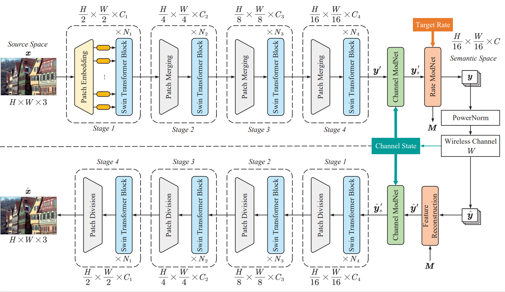

# SwinJSCC: Taming Swin Transformer for Joint Source-Channel Coding

Official Pytorch implementation for "[SwinJSCC: Taming Swin Transformer for Deep Joint Source-Channel Coding](https://arxiv.org/abs/2308.09361)".

This paper has been partially presented in IEEE ICASSP 2023 "[WITT: A Wireless Image Transmission Transformer For Semantic Communications](https://arxiv.org/abs/2211.00937)" and the code is available at [https://github.com/KeYang8/WITT](https://github.com/KeYang8/WITT).

## Introduction
In this paper, we establish a more expressive JSCC codec architecture that can also adapt flexibly to diverse channel states and transmission rates within a single model. Specifically, we demonstrate that with elaborate design, neural JSCC codec built on the emerging Swin Transformer backbone can achieve superior performance than conventional neural JSCC codecs built upon CNN while also requiring lower end-to-end processing latency. Paired with two well-designed spatial modulation modules that scale latent representations based on the channel state information and target transmission rate, our baseline SwinJSCC can further upgrade to a versatile version, which increases its capability to adapt to diverse channel conditions and rate configurations. Extensive experimental results show that our SwinJSCC achieves better or comparable performance versus the state-of-the-art engineered BPG + 5G LDPC coded transmission system with much faster end-to-end coding speed, especially for high-resolution images, in which case traditional CNN-based JSCC yet falls behind due to its limited model capacity. 
As one of the key techniques to realize semantic communications, end-to-end optimized neural joint source-channel coding (JSCC) has made great progress over the past few years. A general trend in many recent works pushing the model adaptability or the application diversity of neural JSCC is based on the convolutional neural network (CNN) backbone, whose model capacity is yet limited, inherently leading to an inferior system coding gain against traditional coded transmission systems. In this paper, we establish a new neural JSCC backbone that can also adapt flexibly to diverse channel conditions and transmission rates within a single model, our open-source project aims to promote research in this field. Specifically, we show that with elaborate design, neural JSCC codec built on the emerging Swin Transformer backbone achieves superior performance than conventional neural JSCC codecs built upon CNN, while also requiring lower end-to-end processing latency. Paired with two spatial modulation modules that scale latent representations based on the channel state information and target transmission rate, our baseline SwinJSCC can further upgrade to a versatile version, which increases its capability to adapt to diverse channel conditions and rate configurations. Extensive experimental results show that our SwinJSCC achieves better or comparable
performance versus the state-of-the-art engineered BPG + 5G LDPC coded transmission system with much faster end-to-end coding speed, especially for high-resolution images, in which case traditional CNN-based JSCC yet falls behind due to its limited model capacity. All pretrain models can be found in [Aliyun Drive](https://www.aliyundrive.com/s/AFu5fZMjgCL)(password:p5ip) or [Google Drive](https://drive.google.com/drive/folders/1_EouRY4yYvMCtamX2ReBzEd5YBQbyesc?usp=sharing).

>  The overall architecture of the proposed SwinJSCC scheme for wireless image transmission.

## Experimental results

* we employ the BPG codec for compression combined with 5G LDPC codes for channel coding (marked as “BPG + LDPC”). Here, we considered 5G LDPC codes with a block length of 6144 bits for different coding rates and quadrature amplitude modulations (QAM).
* the ideal capacity-achieving channel code is also considered during evaluation (marked as “BPG + Capacity”).


# Installation
We implement WITT under python 3.8 and PyTorch 1.9. 


# Usage

## Test
All pretrain models can be found in [Aliyun Drive](https://www.aliyundrive.com/s/AFu5fZMjgCL)(password:p5ip) or [Google Drive](https://drive.google.com/drive/folders/1_EouRY4yYvMCtamX2ReBzEd5YBQbyesc?usp=sharing).

```
python test.py --trainset {'CIFAR10', 'DIV2K'} --testset {'CIFAR10', 'kodak', 'CLIC21'} -- distortion-metric {'MSE', 'MS-SSIM'} --model {'SwinJSCC_w/o_SAandRA', 'SwinJSCC_w/_SA', 'SwinJSCC_w/_RA', 'SwinJSCC_w/_SAandRA'} --channel-type {'awgn', 'rayleigh'} --C {bottleneck dimension} --multiple-snr {random or fixed snr} --model-size {'small', 'base', 'large'}
```

### For SwinJSCC w/ SA&RA model 

*e.g. C = [32, 64, 96, 128, 192], snr = [1, 4, 7, 10, 13], C = [32, 64, 96, 128, 192], metric = PSNR, channel = AWGN

```
e.g.
python test.py --trainset DIV2K --testset kodak -- distortion_metric MSE --model SwinJSCC_w/_SAandRA --channel_type awgn --C 32,64,96,128,192 --multiple-snr 1,4,7,10,13 --model-size base
```

You can apply our method on your own images.


# Citation

If you find this work useful for your research, please cite:

@misc{yang2023swinjscc,
      title={SwinJSCC: Taming Swin Transformer for Deep Joint Source-Channel Coding}, 
      author={Ke Yang and Sixian Wang and Jincheng Dai and Xiaoqi Qin and Kai Niu and Ping Zhang},
      year={2023},
      eprint={2308.09361},
      archivePrefix={arXiv},
      primaryClass={eess.SP}
}

# Acknowledgement
The implementation is based on [WITT: A Wireless Image Transmission Transformer For Semantic Communications](https://arxiv.org/abs/2211.00937) and [Swin Transformer](https://github.com/microsoft/Swin-Transformer).

# Related links
* BPG image format by _Fabrice Bellard_: https://bellard.org/bpg
* Sionna An Open-Source Library for Next-Generation Physical Layer Research: https://github.com/NVlabs/sionna
* DIV2K image dataset: https://data.vision.ee.ethz.ch/cvl/DIV2K/
* Kodak image dataset: http://r0k.us/graphics/kodak/
* CLIC image dataset:  http://compression.cc
